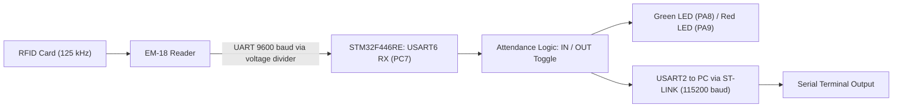
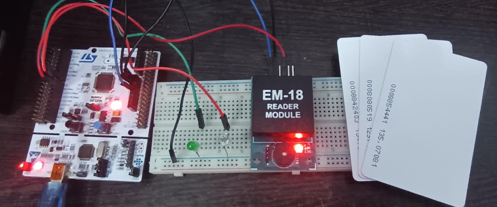
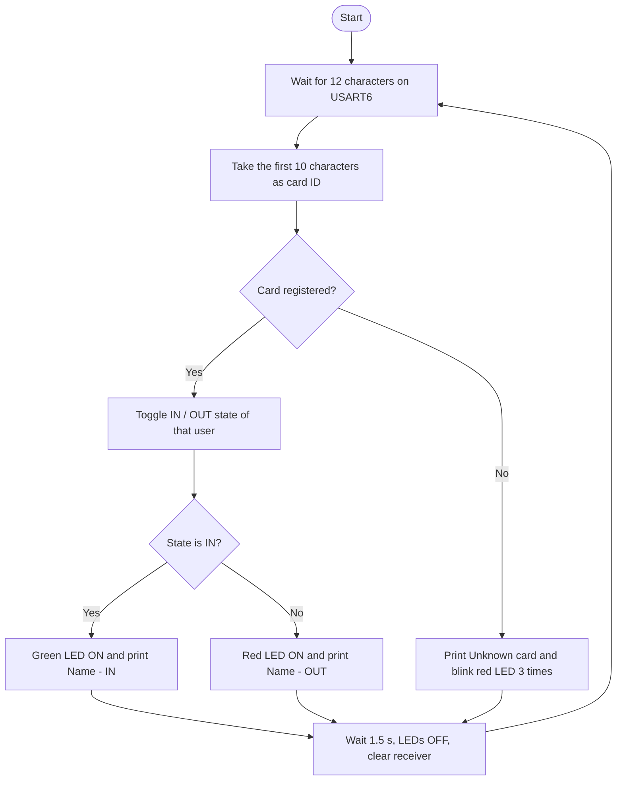
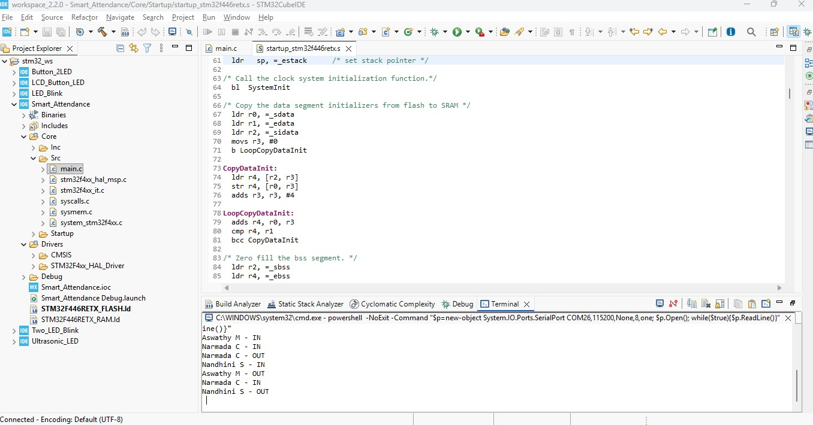

# STM32 NUCLEO-F446RE RFID Smart Attendance Monitoring

## Project Overview

This project is a **smart attendance monitoring system** built on the **STM32 NUCLEO-F446RE** board and an **EM-18 RFID reader (125 kHz)**.

Three registered RFID cards are linked to three people. Each time a registered card is scanned, that person's status toggles between **IN** and **OUT**:

- First scan: the person is marked **IN**, the **green LED** glows, and the terminal shows `Name - IN`.
- Second scan of the same card: the person is marked **OUT**, the **red LED** glows, and the terminal shows `Name - OUT`.
- A card that is not registered is reported as **Unknown card**, and the **red LED** blinks three times.

The attendance log is sent over **UART2** through the on-board ST-LINK virtual COM port to a serial terminal on the PC. The project was created with **STM32CubeMX** and built, flashed and run with **STM32CubeIDE 2.2.0**.

## Key Features

- EM-18 RFID reader interfaced through UART (USART6, 9600 baud)
- Three registered users with automatic IN / OUT toggling
- Green LED for IN, red LED for OUT and unknown cards
- Serial attendance log on the PC (USART2, 115200 baud) through the ST-LINK
- Handling of repeated reads when a card is held near the reader
- 5 V to 3.3 V level conversion for the reader output
- STM32 HAL library

## Hardware Required

| Component | Quantity |
| --------- | -------- |
| STM32 NUCLEO-F446RE board | 1 |
| EM-18 RFID reader module (125 kHz) | 1 |
| 125 kHz RFID cards | 3 |
| Green LED | 1 |
| Red LED | 1 |
| Resistor 1 kΩ and 2 kΩ (voltage divider) | 1 each |
| Breadboard | 1 |
| Jumper wires | As required |
| USB cable (data cable) | 1 |

## System Architecture



## Pin Configuration

| Signal | MCU Pin | Arduino Pin | Mode |
| ------ | ------- | ----------- | ---- |
| EM-18 TX (data in) | PC7 | D9 | USART6_RX (9600 baud) |
| Green LED | PA8 | D7 | GPIO_Output (label `Green`) |
| Red LED | PA9 | D8 | GPIO_Output (label `Red`) |
| PC serial output | PA2 / PA3 | ST-LINK virtual COM port | USART2 (115200 baud) |

## Wiring

| Component | Connection |
| --------- | ---------- |
| EM-18 VCC | 5V |
| EM-18 GND | GND |
| EM-18 TX | 1 kΩ resistor, then D9 (PC7) |
| D9 (PC7) junction | 2 kΩ resistor to GND |
| Green LED long leg (+) | D7 (PA8) |
| Red LED long leg (+) | D8 (PA9) |
| Both LED short legs (-) | GND |

The EM-18 works at 5 V and its output uses 5 V logic, so the 1 kΩ and 2 kΩ divider reduces the signal to about 3.3 V for the STM32 pin. A resistor of 220 Ω to 1 kΩ in series with each LED is recommended.

## Project Setup



## STM32CubeMX Configuration

1. Create a new project and select the **NUCLEO-F446RE** board in the Board Selector.
2. Initialize all peripherals with their default mode. This enables **USART2** for the ST-LINK virtual COM port.
3. Set **PA8** to `GPIO_Output` with the label `Green`, and **PA9** to `GPIO_Output` with the label `Red`.
4. Open **Connectivity → USART6**, set the mode to **Asynchronous** and the baud rate to **9600** (8 data bits, no parity, 1 stop bit). Check that **PC7** shows `USART6_RX`.
5. Check that **USART2** is **Asynchronous** at **115200**.
6. In the Project Manager, set the project name and a parent folder, choose **STM32CubeIDE** as the toolchain, and click **Generate Code**.

| Peripheral | Purpose | Setting |
| ---------- | ------- | ------- |
| USART6 | Receives the card ID from the EM-18 | 9600 baud, 8N1 |
| USART2 | Sends the attendance log to the PC | 115200 baud, 8N1 |
| PA8 / PA9 | Green and red LEDs | GPIO_Output |

## Working Principle

1. The EM-18 reads a 125 kHz card and sends **12 ASCII characters** at 9600 baud: **10 characters of card ID** followed by 2 checksum characters.
2. The STM32 receives the 12 characters on **USART6** and keeps the first 10 as the card ID.
3. The ID is compared with the list of registered cards.
4. For a registered card, the person's IN / OUT state is toggled, the matching LED glows and the message is sent to the PC.
5. For an unregistered card, an "Unknown card" message is sent and the red LED blinks three times.
6. After a short delay the LEDs are turned off and the receiver is cleared, so a card held near the reader is not counted twice.



## Attendance Behaviour

| Scan | Terminal Output | LED |
| ---- | --------------- | --- |
| Card 1, first scan | `Nandhini S - IN` | Green |
| Card 1, second scan | `Nandhini S - OUT` | Red |
| Card 2, first scan | `Narmada C - IN` | Green |
| Card 3, first scan | `Aswathy M - IN` | Green |
| Unregistered card | `Unknown card <ID>` | Red blinks 3 times |

## Code

All user code is placed inside the `USER CODE` sections of `Core/Src/main.c`.

Registered users (replace the IDs with the 10-character IDs of your own cards):

```c
#define NUM_USERS 3

const char *card_id[NUM_USERS]   = { "XXXXXXXXXX", "YYYYYYYYYY", "ZZZZZZZZZZ" };
const char *user_name[NUM_USERS] = { "Nandhini S", "Narmada C", "Aswathy M" };
uint8_t inside[NUM_USERS]        = { 0, 0, 0 };    // 0 = OUT, 1 = IN
```

Helper functions:

```c
static void pc_print(const char *s)
{
  HAL_UART_Transmit(&huart2, (uint8_t *)s, strlen(s), 100);
}

static void flush_rx(void)            // discard repeated reads of the same card
{
  uint8_t c;
  __HAL_UART_CLEAR_OREFLAG(&huart6);
  while (HAL_UART_Receive(&huart6, &c, 1, 5) == HAL_OK) { }
}

static int find_user(const char *id)  // returns 0 to 2, or -1 if unknown
{
  for (int i = 0; i < NUM_USERS; i++)
    if (strncmp(id, card_id[i], 10) == 0) return i;
  return -1;
}
```

Main loop:

```c
uint8_t rx[12];
__HAL_UART_CLEAR_OREFLAG(&huart6);

if (HAL_UART_Receive(&huart6, rx, 12, 200) == HAL_OK)
{
  char id[11];
  char msg[80];
  memcpy(id, rx, 10);                     // first 10 characters = card ID
  id[10] = '\0';

  int u = find_user(id);

  if (u >= 0)                             // registered card
  {
    inside[u] = !inside[u];               // IN becomes OUT, OUT becomes IN

    if (inside[u])
    {
      HAL_GPIO_WritePin(Green_GPIO_Port, Green_Pin, GPIO_PIN_SET);
      snprintf(msg, sizeof(msg), "%s - IN\r\n", user_name[u]);
    }
    else
    {
      HAL_GPIO_WritePin(Red_GPIO_Port, Red_Pin, GPIO_PIN_SET);
      snprintf(msg, sizeof(msg), "%s - OUT\r\n", user_name[u]);
    }
    pc_print(msg);
    HAL_Delay(1500);
  }
  else                                    // unknown card
  {
    snprintf(msg, sizeof(msg), "Unknown card %s\r\n", id);
    pc_print(msg);
    for (int i = 0; i < 3; i++)
    {
      HAL_GPIO_WritePin(Red_GPIO_Port, Red_Pin, GPIO_PIN_SET);
      HAL_Delay(150);
      HAL_GPIO_WritePin(Red_GPIO_Port, Red_Pin, GPIO_PIN_RESET);
      HAL_Delay(150);
    }
  }

  HAL_GPIO_WritePin(Green_GPIO_Port, Green_Pin, GPIO_PIN_RESET);
  HAL_GPIO_WritePin(Red_GPIO_Port, Red_Pin, GPIO_PIN_RESET);
  flush_rx();
}
```

## Reading Card IDs

To register your own cards, leave the placeholder IDs in the code, run the program and scan each card. The terminal prints the ID of every unregistered card:

```
Unknown card XXXXXXXXXX
```

Copy each ID into the `card_id` list in the order of the names, then build and run again.

## Serial Monitor Output

The attendance log is shown in a terminal inside STM32CubeIDE.

**Step 1: Open the terminal.** Go to `Window → Show View → Other... → Terminal → Terminal`, click **Open**, then click the **Open a Terminal** icon and choose **Local Terminal**.

**Step 2: Find the COM port.** In Device Manager, under *Ports (COM & LPT)*, note the number of the **STMicroelectronics STLink Virtual COM Port**.

**Step 3: Paste the command.** Run the program first and keep no Debug session open. If the prompt looks like `C:\Users\name>`, paste:

```
powershell -NoExit -Command "$p=new-object System.IO.Ports.SerialPort COM26,115200,None,8,one; $p.Open(); while($true){$p.ReadLine()}"
```

If the prompt starts with `PS` (already PowerShell), paste:

```
$p=new-object System.IO.Ports.SerialPort COM26,115200,None,8,one; $p.Open(); while($true){$p.ReadLine()}
```

Change `COM26` to your own COM number. Press `Ctrl+C` to stop, and close the terminal before flashing again.

### Output

```
Nandhini S - IN
Nandhini S - OUT
Narmada C - IN
Aswathy M - IN
Unknown card XXXXXXXXXX
```



## Demonstration Video

[▶️ Watch the RFID Smart Attendance Demonstration](https://drive.google.com/file/d/1Fds22KPVmySXyau9RQokeuDQGWUd4-iz/view?usp=drivesdk)

## How to Run

1. Wire the EM-18, LEDs and divider as shown above.
2. Open **STM32CubeIDE** and go to `File → Import → General → Existing Projects into Workspace`.
3. Select the project folder and click **Finish**.
4. Put the IDs of your cards in `card_id` and the names in `user_name`.
5. Build with the hammer icon, connect the board by USB, and click **Run**.
6. Open the terminal as described above and scan the cards.

## Testing

| Test | Result |
| ---- | ------ |
| Build | 0 errors |
| Flash through ST-LINK | Successful |
| Card ID read from EM-18 | 10-character ID received |
| Registered card, first scan | IN, green LED |
| Registered card, second scan | OUT, red LED |
| Unregistered card | Unknown card message, red LED blinks |

## Important Notes

- The EM-18 only reads **125 kHz** tags. 13.56 MHz cards do not work.
- The IN / OUT state is kept in RAM, so every user is **OUT** again after a reset.
- Close the serial terminal before flashing, otherwise the COM port can be reported as busy.
- The COM number can change when a different USB port is used.
- Both **CN2** jumper caps on the board must be fitted for programming.
- Write your own code only between the `USER CODE BEGIN` and `USER CODE END` comments.

## Technologies and Concepts

- STM32 NUCLEO-F446RE and STM32CubeIDE 2.2.0
- STM32CubeMX and the HAL library
- UART communication (USART2 and USART6)
- RFID with the EM-18 reader
- GPIO output and LED indication
- State toggling and string handling in C
- Voltage level conversion with a resistor divider

## Future Improvements

- Show the name and IN / OUT status on a 16×2 I2C LCD
- Add a time stamp using a real-time clock
- Count the number of people currently inside
- Store the attendance log on an SD card or send it to a server
- Add more users and store them in flash memory
